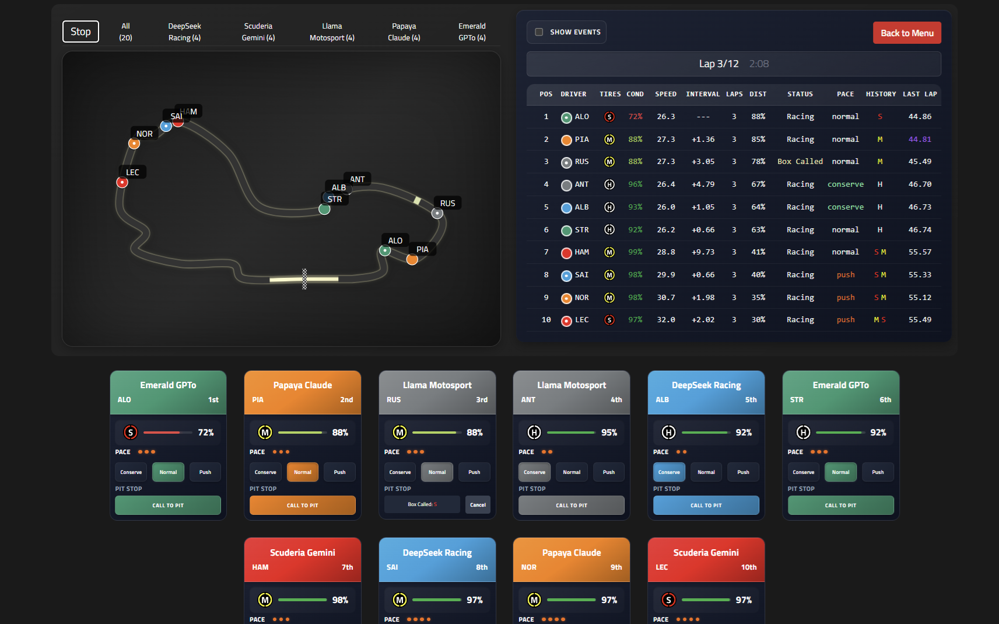

# FormulaGPT

## Project Overview

**FormulaGPT** is an experimental Formula 1 racing simulator where you can directly **compete against advanced LLMs** (Large Language Models) such as **OpenAI's GPT models**, **Anthropic's Claude**, **DeepSeek**, and others. These AI-powered teams dynamically analyze on-track scenarios in **natural language**, strategically suggesting pit-stop timings, tire selections, and driving styles—all aiming to outsmart their rivals and secure victory.

As a player, you'll craft your own racing strategy, testing your skills against cutting-edge AI. It’s like going head-to-head with a rival team led by an AI strategist—analyzing the race in real time and trying to outmaneuver you at every turn!

Try it online now at:  
**[https://formula-gpt.vercel.app/](https://formula-gpt.vercel.app/)**

- **Bring your own API key** for providers like OpenAI, Anthropic (Claude), DeepSeek, and others via OpenRouter.  
  *or*  
- **Use Free Mode**: Gemini 2.0 Flash Lite (no API key required)

Your mission: **strategically outsmart advanced AI teams**, leveraging clever pit-stop timing, tire management, and adaptive race tactics to achieve victory in a dynamic, real-time racing environment.

Curious how it works in practice? Check out a demo video showing FormulaGPT in action:
**[https://youtu.be/tAv6Qz2SmIs/](https://youtu.be/tAv6Qz2SmIs/)**



## Features

1. **AI vs. Player Showdown**  
   - Decide which teams are controlled by you and which belong to an AI model.  
   - Battle it out on the track with real-time decision-making.

2. **AI vs. AI Mode (Local Only)**  
    - Watch races between fully autonomous AI teams.
    - Go beyond just visuals—access each AI team manager’s full strategic reasoning and thought process via console logs.
    - Perfect for analyzing how different LLMs like Claude, GPT, or DeepSeek interpret and react to race scenarios. 

3. **Pre-Race Setup (Local Only)**  
   - Randomize the starting grid, choose your tires, or let AI generate initial race strategies.  
   *Note: This feature is not available in the online Vercel deployment.*

4. **Dynamic Race Simulation**  
   - Tire degradation, pit stops, speed penalties for following too closely, disqualification for not changing tire compounds, etc.

5. **Interactive Scoreboard & RaceTrack**  
   - *Scoreboard*: Keep track of positions, tire conditions, and intervals.  
   - *RaceTrack*: Visual animation of cars on a custom path.

6. **Notifications & Events**  
   - Team messages appear in a chat-like modal (e.g. AI instructions).  
   - Real-time event logging (overtakes, pit calls, etc.).

## Requirements & Installation

- **Node.js** >= 14 (Node 18 recommended)
- **npm** *(default)* or **yarn** *(alternative)* to manage dependencies

**Installation**:

```bash
# Using npm:
npm install

# (Optionally, if you prefer Yarn and there's a yarn.lock available):
yarn
```

## Quick Start 

1. **Run Development Server**:

   ```bash
   npm start
   ```
  


   The application will be available at:  
   **[http://localhost:3000](http://localhost:3000)**

2. **Try Online**:  
   Visit the deployed version at:  
   **[https://formula-gpt.vercel.app/](https://formula-gpt.vercel.app/)**

## Folder Structure

```
src/
├─ assets/                # Static assets (images, audio)
├─ components/            # Main React components
├─ contexts/              # Context API (e.g. ScaleContext)
├─ data/                  # Core data: track config, prompts, tire definitions, etc.
├─ hooks/                 # Custom Hooks for race logic
├─ services/              # AI-related service logic (requests)
├─ utils/                 # Helper functions
├─ App.jsx                # Main application component
├─ App.css                # Global CSS
└─ index.js               # Entry point
```

## Key Components

1. **`App.jsx`**  
   - Central orchestration of the simulation. Ties together `PreRaceMenu`, `Scoreboard`, `NotificationsModal`, etc.

2. **`ApiConfigModal.jsx`**  
   - Panel for configuring API keys & switching to *Free Mode*.

3. **`PreRaceMenu.jsx`**  
   - Lets you designate human- vs. AI-controlled teams.
   - Provides randomization (grid, tires) and AI strategy generation.

4. **`RaceTrack.jsx`**  
   - SVG-based track animation (using framer-motion).  
   - Shows cars moving with real-time updates.

5. **`Scoreboard.jsx`**  
   - Displayed classification table with position, speed, tire condition, and intervals.

6. **`NotificationsModal.jsx`**  
   - Chat-like popup for AI messages.
   - Optionally pauses the race for reading.

## API Management

Located in `services/aiService.js`:
- **`generateAIStrategy(...)`** – AI’s initial tire selection logic.
- **`sendTeamQuery(...)`** – AI’s mid-race updates for strategy.

**Configuration**: 
- In the app’s **API Configuration** panel, specify keys for OpenAI or OpenRouter.
- Use *Free Mode* (Gemini 2.0 Flash Lite) if no key is set.

## Extensibility & Customization

Primary race parameters and text prompts reside in **`src/data/`**:
- **`constants.js`**: Track points (`trackPoints`), tire definitions (`TIRE_TYPES`), etc.
- **`teamPrompts.js`**, **`sharedPrompts.js`**, **`tireDecisionPrompt.js`**: default AI prompts and instructions.  
- Tweak them to suit your own custom scenario or adapt the logic for different LLM usage.

## Console Logging & Debugging

- **Request & Response Logs**: The full API prompts (system & user) and the complete AI response are printed in the browser console.  
- **Reasoning vs. Content**: Some LLMs (like `deepseek/r1`) may separate `'reasoning'` and `'content'`. Only `'content'` is displayed in the app’s chat, but `'reasoning'` is visible in console logs—useful for debugging or deeper insight into the AI’s thought process.

## Contributions & Collaboration

I welcome contributions:
- File **Issues** for bugs or feature requests.
- Make **Pull Requests** with changes or new ideas.

## License

This project is under the **MIT License**.  
See [LICENSE](LICENSE) for details.  

Feel free to copy, modify, and distribute the code under those terms.

---

Thank you for exploring **FormulaGPT**!  
Compete against AI-driven teams, refine your strategies, and see if you can take the checkered flag. Enjoy!